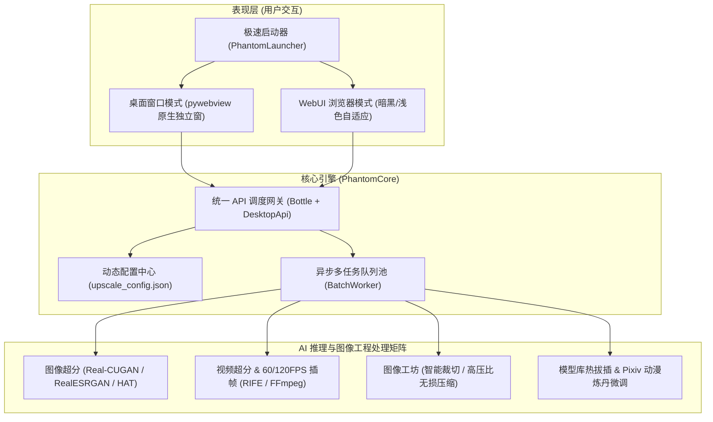

# 全能视像解析终端 (OmniVisionTerminal / PhantomVision)

<div align="center">


### 一只二次元死宅为了拯救画质与追番特化打磨的究极视像解析终端

[](https://github.com/yaoming00268/OmniVisionTerminal/stargazers)
[](https://github.com/yaoming00268/OmniVisionTerminal/releases)
[](https://www.python.org/)
[](https://pytorch.org/)
[](LICENSE)
[](https://www.microsoft.com/)

<p align="center">
  <b>桌面独立窗口 / 现代化 WebUI 双模同芯架构 · 二次元顶级多模型超分 · 动漫视频插帧补帧 · 图像工坊 · 模型热拔插炼丹</b>
</p>

</div>

---

## 为什么会有这个玩意儿？（死宅前言）

你是否也有过这样的绝望破防时刻：
- **推远古 Galgame / 经典老番时**：分辨率只有可怜的 720P 甚至 480P，全屏展开全是马赛克与色块，老婆眼睛里的星辰大海直接糊成一片！
- **好不容易在 Pixiv / X 挖到神仙同人图**：结果原图是带重度压缩噪点的渣画质，想要当壁纸放大却满屏毛边！
- **超分透明立绘 / 动态表情包 / 免抠素材时**：网上很多工具直接把 Alpha 透明通道抹成漆黑一团，或者边缘发绿发白当场报废！
- **想给番剧短片补到 60fps/120fps 丝滑流畅**：传统软件动不动爆显存 (CUDA Out of Memory) 闪退红温，环境配置更是让人抓狂！

为了彻底终结这堆折磨，本死宅（千绘莉的忠实信徒）亲自动手搓出了这套 **「全能视像解析终端 (OmniVisionTerminal / PhantomVision)」**！不用再去东拼西凑各种零碎脚本，不管是图片放大、马赛克去噪、透明图无损超分、番剧 120 帧补帧、无损压缩还是局部裁切，全部开箱即食，一条龙统统搞定！芜湖起飞！

---

## 核心功能全景矩阵



### 1. 双端同芯 · 极简三模架构 (Triple Mode & Unified Engine)
- **桌面原生窗口模式 (Desktop)**: 基于 `pywebview` 打造的原生独立应用，无需开启浏览器、不霸占网络端口，毫秒级快速启动；原生系统文件与目录选择框，超分完毕可一键直达资源管理器定位结果，摸鱼追番无缝衔接！
- **现代化 WebUI 模式 (WebUI)**: 极具科技感的现代化响应式界面，支持浅色/暗黑主题自由切换与自定义二次元背景大图；开启局域网共享 (`0.0.0.0`) 后，躺在被窝里用手机或 iPad 也能远程给宿舍主力电竞主机派单超分！
- **纯后台守护模式 (Service)**: 纯静默守护运行，零界面占用，提供标准 RESTful API，方便嵌入自动化工作流或集群协同。
- **统一后端架构 (v2.4+)**: 三大模式共用底层同一套 `PhantomCore` 计算核心，告别多套运行库的冗余膨胀，体积大幅瘦身！

### 2. 动漫特化顶级 AI 超分模型全家桶 (AI Super-Resolution)
针对二次元动漫画风、线稿、赛璐珞、厚涂以及真实场景精选整合顶级开源权重：
- **Real-CUGAN 系列 (二次元特化神级模型)**:
  - `pro-no-denoise` (2x / 3x): 无降噪纯净版，适合原本就清晰的官方画集/原画无损放大，笔触线条锐利如刀。
  - `pro-conservative` (2x / 3x): 保守克制版，最大限度保留原作纹理神韵与纸本质感，杜绝油画感失真。
  - `pro-denoise3x` (2x / 3x): 强力去噪黑魔法！拯救上古低清盗版截图、满是 JPEG 杂讯的陈年本子与严重马赛克。
- **Real-ESRGAN / RealESRNet 系列 (泛用兼顾真实系)**:
  - `anime_6B`: 经典二次元泛用主力，线条重塑力一流。
  - `realesr-animevideov3`: 动画视频极速模型，批量大图与视频序列处理飞起。
  - `RealESRGANv2-animevideo-xsx2/xsx4`: 极致轻量微型模型，显存占用极小，轻薄本与低配核显阿宅的救星。
  - `x4plus` & `RealESRNet_x4plus`: 针对三次元现实摄影与复杂现实风景，真实质感自然平滑。
- **HAT 系列 (Transformer 超分天花板)**:
  - `HAT_x4`: 细节生成极其激进，高算力高端显卡专属，追求极致视像盛宴的首选！
- **核心黑科技护航**:
  - **动态切块渲染 (Tile / Block Size)**: 大图自动分块切片推理并无缝拼接重组，彻底告别显存爆仓 OOM 崩溃！
  - **透明通道 (Alpha Channel) 优化**: 独家透明图层保护算法，超分立绘、透明表情包绝不发黑、不泛白、边缘羽化平滑无瑕！

### 3. 动漫视频超分 & 60/120FPS 丝滑补帧 (Video Engine)
- **三大视频工作流**: 支持「仅超分 (`upscale_only`)」、「仅插帧 (`interp_only`)」与「超分+插帧全开 (`both`)」！
- **倍率自由随心**: 支持 2x / 4x 多倍插帧，配合音视频流无损提取、分块逐帧处理与 FFmpeg 高码率重新封装，老旧 24 帧番剧秒变 60 帧 / 120 帧高刷丝滑神仙画质！

### 4. 阿宅高产图像工坊三件套 (Image Toolbox)
- **极致图像高压比无损压缩 (Image Compressor)**: 一键批量转 WebP / PNG，支持质量因子调节。同等肉眼画质下体积直降 50%~80%，为老阿宅的硬盘腾出大半个 Steam 游戏库！
- **局部精准智能裁切 (Smart Cropper)**: 自由拖选老婆的特写头像或立绘细节，自带即时裁切效果预览对比，支持「覆盖原图」或「另存副本」。
- **全能队列批量处理**: 支持文件拖拽、原生对话框批量点选，以及**直接粘贴本地路径/文件夹**，自动递归抓取所有子目录图片与视频！

### 5. 模型库热拔插管理 & Pixiv 炼丹微调工作台 (Model Management & Train)
- **模型库热拔插管理**: 在主界面直接导入本地 `.pth` 外部模型，支持在线重命名、删除与拖拽调整优先级排序。
- **炼丹工作台 (Train Worker)**: 内置 Pixiv / 动漫图集微调训练流，自定义数据集目录、训练轮数 (Epoch)、批大小 (Batch Size)、学习率与模型保存频率，炼出专属于你心水画风的超分模型！

### 6. 死宅细节狂魔级别的交互体验 (Otaku UX)
- **实时超分前后画质同屏对比**: 任务执行过程中自动渲染前后滑动对比图，肉眼可见的细节提升带来极致颅内愉悦！
- **任务随时暂停/继续**: 显卡温度过高或者想先打把打歌/吃鸡？随时一键暂停，空闲时一键继续！
- **参数锁定防护**: 设置好倍率与切块大小后一键锁定，杜绝批量任务期间手滑误改！
- **自定义老婆壁纸**: 支持配置自定义背景图片与主题自适应，打开终端的第一眼就是推的笑容！

---

## 预构建便携版下载 (Download Releases)

不想折腾复杂 Python 与 CUDA 依赖环境的绅士们，可以直接前往下载预编译开箱即用便携版：

### 途径一：GitHub Releases 下载（推荐）
前往 [GitHub Releases v2.4.0](https://github.com/yaoming00268/OmniVisionTerminal/releases) 页面：
由于 GitHub 单文件 Release 限制单个文件不得超过 2GB，便携版封装包（约 2.34 GB）采用业界标准多卷分卷打包：
- `全能视像解析终端_便携版_v2.4.0.zip.001` (卷一)
- `全能视像解析终端_便携版_v2.4.0.zip.002` (卷二)

**解压食用姿势：**
1. 将两个 `.zip.001` 和 `.zip.002` 文件下载到**同一个文件夹**下。
2. 使用常用的压缩软件（如 **7-Zip** 或 **Bandizip**），右键点击 `全能视像解析终端_便携版_v2.4.0.zip.001`，选择「解压到当前文件夹」即可自动连卷解压！
3. 或者打开 CMD 命令行执行一行命令快速合并后再解压：
   ```cmd
   copy /b 全能视像解析终端_便携版_v2.4.0.zip.001 + 全能视像解析终端_便携版_v2.4.0.zip.002 全能视像解析终端_便携版_v2.4.0.zip
   ```

### 途径二：谷歌云盘 (Google Drive) 完整免安装包直达
如果你更习惯网盘单文件直接满速下载，可使用本终端作者同步上传的谷歌云盘单文件镜像：
- **Google Drive 直达链接**: [OmniVisionTerminal 便携免安装完整版 (Google Drive)](https://drive.google.com/drive/folders/18e8A2xqJflYHBNykImmglnKGQqTV9xx4) *(可在云端硬盘 OmniVisionTerminal 目录下直接下载单文件 zip)*

---

## 便携版使用指南

解压完成后，你会看到如下清爽干净的目录结构：
```text
全能视像解析终端_便携版_v2.4.0/
├── PhantomLauncher/       # 现代化启动器
├── PhantomCore/           # 核心引擎服务与模型库
│   ├── PhantomCore.exe
│   └── models/            # AI 模型权重存放目录
├── 示例图片/               # 内置测试样张(可直接拖入体验)
└── 使用说明.txt
```

### 快速启动
1. **双击启动 `PhantomLauncher\PhantomLauncher.exe`**：
   - 弹出毫秒级启动器，自由选择：
     - **桌面窗口模式**（最推荐，无端口冲突，独立窗口运行）
     - **WebUI 浏览器模式**（适合多设备内网串流使用）
     - **仅后台服务模式**（适合开发者 API 调用）
   - 勾选「记住我的选择」后，下次启动直接秒进对应模式！
2. **免安装与便携性**：
   - 所有模型与运行配置文件 `upscale_config.json` 均保存在程序自身目录内，放进移动固态硬盘或 U 盘随插随用，纯净无残留！

---

## 极客专属：源码运行与本地折腾

如果你也是喜欢折腾源码、想要自己魔改的同道阿宅，欢迎本地跑跑看：

### 1. 环境准备
推荐使用 **Python 3.10**，且强烈建议拥有 NVIDIA 独立显卡（已安装 CUDA 驱动）：
```powershell
# 1. 克隆本仓库
git clone https://github.com/yaoming00268/OmniVisionTerminal.git
cd OmniVisionTerminal

# 2. 创建并激活虚拟环境
python -m venv .venv
.\.venv\Scripts\Activate.ps1

# 3. 安装 PyTorch (建议配合你的 CUDA 版本)
pip install torch torchvision --index-url https://download.pytorch.org/whl/cu121

# 4. 安装核心依赖
pip install -r requirements.txt
```

### 2. 本地直接启动
```powershell
# 方式 A: 启动原生桌面窗口版
python desktop.py

# 方式 B: 启动现代 WebUI 浏览器版 (默认端口 7860)
python main.py

# 方式 C: 启动卡片式启动器
python launcher_pwv.py
```
或者直接双击根目录下的快捷启动脚本：
- `start_desktop.bat` (桌面版)
- `start_webui.bat` (WebUI 版)
- `start_launcher.bat` (启动器)

### 3. 打包封装二进制 EXE
项目内提供了完备的自动化 PyInstaller 规范与构建脚本：
```powershell
# 封装核心引擎
.\build_core.bat

# 或者运行桌面版打包 PowerShell 脚本
powershell -ExecutionPolicy Bypass -File pack\build_desktop.ps1
```

---

## 项目技术架构

```text
OmniVisionTerminal/
├── app/                  # WebUI 服务层 (Bottle API 路由与控制器)
│   ├── api.py            # RESTful API 端点实现 (任务/模型/硬件状态)
│   └── server.py         # Web 服务器启动与端口冲突自动顺延逻辑
├── core/                 # 核心计算与算法层
│   ├── upscaler.py       # Spandrel 统一模型调度与切块超分推理引擎
│   ├── video.py          # 视频音频解离、补帧插帧、动态压制
│   ├── models.py         # 模型库动态注册、热更新、哈希校验
│   ├── batch_worker.py   # 异步多任务队列池与调度状态机
│   ├── compressor.py     # 高保真 WebP/PNG 图像高压比压缩引擎
│   ├── hardware.py       # 实时 GPU 显存/温度/CPU 占用监控
│   ├── train_worker.py   # Pixiv 动漫图集微调炼丹流
│   └── config_manager.py # 用户配置持久化与编码乱码防护
├── web/                  # 前端静态资源 (HTML5 / CSS3 / ES6 / WebComponents)
│   ├── index.html        # 主控制台视图
│   ├── launcher.html     # 启动器选择窗视图
│   └── static/           # 样式、图标与脚本
├── pack/                 # 打包与发布工具链 (Spec/Inno Setup/测试套件)
├── desktop.py            # pywebview 桌面原生模式主入口
├── desktop_api.py        # JS 与 Python 桌面双向原生 RPC 桥接
├── launcher_pwv.py       # 启动器主入口
├── main.py               # WebUI / 后台引擎主入口
├── upscale_config.json   # 核心运行配置文件
└── requirements.txt      # 依赖环境清单
```

---

## 常见问题答疑 (FAQ)

> **Q: 为什么我启动桌面版显示空白或者提示缺少 WebView2？**  
> A: 桌面版基于 Windows 原生 WebView2 核心（Windows 10/11 通常已自带）。如果精简版系统缺失，请前往微软官网安装「Microsoft Edge WebView2 Runtime」，或者直接启动 WebUI 浏览器模式！

> **Q: 显卡显存比较小（例如 4GB / 6GB），超分大图会不会崩？**  
> A: 绝不崩！请在工作台把「切块大小 (block_size)」调小（例如 256 或 400），或者选用极速微型模型 `RealESRGANv2-animevideo-xsx2`，显存占用低至几百兆！

> **Q: 模型文件缺失怎么破？**  
> A: 终端内置了全自动下载校验机制。当你切换到本地暂未缓存的模型时，系统会自动从 HuggingFace / GitHub Release 节点拉取权重；你也可以直接在「模型库」窗口手动拖入你自己珍藏的 `.pth` 模型！

---

## 鸣谢与致谢 (Credits)

本项目的诞生离不开开源社区诸多伟大项目与大佬们的贡献，特别鸣谢：
- [Real-CUGAN](https://github.com/bilibili/ailab/tree/main/Real-CUGAN) by bilibili: 拯救二次元的动漫超分辨率神级算法！
- [Real-ESRGAN](https://github.com/xinntao/Real-ESRGAN) by Xintao: 经典强大的超分辨率通用模型架构。
- [HAT](https://github.com/XPixelGroup/HAT) by XPixelGroup: 顶尖的高清细节生成混合架构。
- [spandrel](https://github.com/chaiNNer-org/spandrel): 强大的统一 PyTorch 图像恢复模型加载库。
- [pywebview](https://pywebview.flowrl.com/): 轻量高效的跨平台原生窗口绑定库。

---

## 免责声明

1. 本项目仅供 Python、深度学习与图像处理爱好者个人学习交流使用，请勿用于任何商业侵权或非法用途。
2. 批量处理受版权保护的动漫、插画与视频时，请自觉尊重原画师与内容版权方的合法权益。

---

<div align="center">

> 咕咕咕？不，本死宅的代码绝对不鸽！  
> 如果这个小工具拯救了你推的远古画质，请顺手右上角点一个 **Star** 鼓励一下这只屑开发者吧！  
> 喵呜~

</div>
